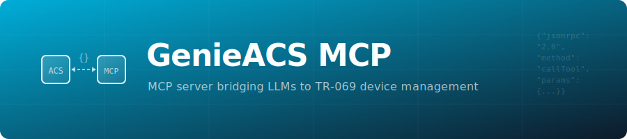

<p align="center">
  
</p>

# GenieACS-MCP

_A tiny bridge that exposes any GenieACS instance as an **MCP v1**
(JSON-RPC for LLMs) server written in Go._

  
  


---

## ✨ What you get

| Type            | What for                                                                   | MCP URI / Tool id                |
|-----------------|----------------------------------------------------------------------------|----------------------------------|
| **Resources**   | Consume GenieACS data read-only                                            | `genieacs://device/{id}`<br>`genieacs://file/{name}`<br>`genieacs://tasks/{id}`<br>`genieacs://devices/list` |
| **Tools**       | Invoke actions on a CPE through GenieACS                                   | `reboot_device`<br>`download_firmware`<br>`refresh_parameter` |

Everything is exposed over a single JSON-RPC endpoint (`/mcp`).  
LLMs / Agents can: `initialize → readResource → listTools → callTool` … and so on.

---

## 🚀 Quick-start (Docker Compose)

Follow instructions from https://github.com/GeiserX/genieacs-docker, it is included in the docker compose file there.

## 🛠 Local build

```sh
git clone https://github.com/GeiserX/genieacs-mcp
cd genieacs-mcp

# (optional) create .env from the sample
cp .env.example .env && $EDITOR .env

go run ./cmd/server
```

## 🔧 Configuration
| Variable | Default | Description |
|----------|---------|-------------|
| `ACS_URL` | http://localhost:7557 | GenieACS NBI endpoint (without trailing /) |
| `ACS_USER` | admin | GenieACS username |
| `ACS_PASS` | admin | GenieACS password |

Put them in a `.env` file (from `.env.example`) or set them in the environment. 


## Testing
Tested with [Inspector](https://modelcontextprotocol.io/docs/tools/inspector) and it is currently fully working. Before making a PR, make sure this MCP server behaves well via this medium.

Lacks Testing with actual MCP clients (client LLMs), so please, submit your PRs to improve descriptions in case it fails to adequately match the services offered by this MCP server.

## Example configuration for client LLMs:

```json
{
  "schema_version": "v1",
  "name_for_human": "GenieACS-MCP",
  "name_for_model": "genieacs_mcp",
  "description_for_human": "Read data from GenieACS and run actions on CPEs (reboot, firmware update, parameter refresh).",
  "description_for_model": "Interact with an Auto-Configuration-Server (ACS) that manages routers. First call initialize, then reuse the returned session id in header \"Mcp-Session-Id\" for every other call. Use readResource to fetch URIs that begin with genieacs://. Use listTools to discover available actions and callTool to execute them.",
  "auth": { "type": "none" },
  "api": {
    "type": "jsonrpc-mcp",
    "url":  "http://localhost:8080/mcp",
    "init_method": "initialize",
    "session_header": "Mcp-Session-Id"
  },
  "logo_url": "https://raw.githubusercontent.com/GeiserX/genieacs-docker/master/extra/logo.png",
  "contact_email": "acsdesk@protonmail.com",
  "legal_info_url": "https://github.com/GeiserX/genieacs-mcp/blob/main/LICENSE"
}
```

## Credits
[GenieACS](https://github.com/genieacs/genieacs) – the best open-source ACS

[MCP-GO](https://github.com/mark3labs/mcp-go) – modern MCP implementation

[GoReleaser](https://goreleaser.com/) – painless multi-arch releases

## Maintainers

[@GeiserX](https://github.com/GeiserX).

## Contributing

Feel free to dive in! [Open an issue](https://github.com/GeiserX/genieacs-mcp/issues/new) or submit PRs.

GenieACS-MCP follows the [Contributor Covenant](http://contributor-covenant.org/version/2/1/) Code of Conduct.
