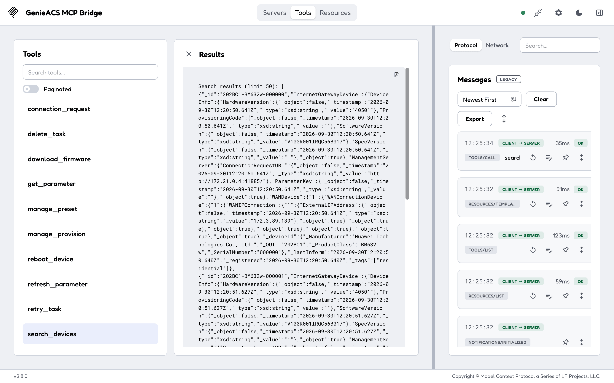
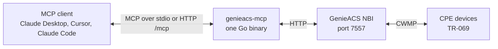

---
hide:
  - navigation
---

# genieacs-mcp { .gm-visually-hidden }

  

  
  
  
  

---

**genieacs-mcp** is an MCP server for [GenieACS](https://github.com/genieacs/genieacs), the open-source TR-069 ACS that manages routers, ONTs and other CPE devices. Add it to Claude Desktop, Cursor or any other MCP client and ask in plain words: which devices stopped informing last night, what firmware serial 000003 runs, reboot the ones tagged `pilot`. The assistant reads and acts through your GenieACS NBI with 7 resources and 12 tools; one Go binary, no database of its own. Start with [Getting started](getting-started.md), then [Usage](usage.md) for what the assistant can read and do.

-   :material-download: **[Getting started](getting-started.md)**

    ---

    npm, Docker Compose or a local build, a demo ACS with simulated devices, and what the first exchange looks like.

-   :material-connection: **[Connect your client](configuration.md#client-configuration)**

    ---

    The `mcpServers` block for Claude Desktop, Cursor and Claude Code over stdio, and the `url` block for a server you already run over HTTP.

-   :material-chat-question-outline: **[Usage](usage.md)**

    ---

    Example prompts, the 7 resources, the 12 tools with their arguments, and which of them change a device or the ACS.

-   :material-format-list-bulleted: **[Configuration](configuration.md)**

    ---

    Every environment variable with its default, and the HTTP transport's security model.

## What the assistant sees

An MCP client sees 7 resources it can read (`genieacs://devices/list`, `genieacs://device/{id}`, tasks, faults, files, presets, provisions) and 12 tools it can call. `search_devices` takes a MongoDB-style filter, so "devices tagged residential" or "devices that last informed before yesterday" is one call. The tool list, the resource catalogue and a `set_parameter` call are shown on [Usage](usage.md).

## Read versus act

- `search_devices`, `get_parameter` and the seven resources only read the ACS; `get_parameter` answers from the ACS cache without contacting the device.
- The other ten tools queue a task on a device (reboot, firmware download, refresh or set a parameter), wake it with a connection request, or change the ACS (tags, presets, provisions, tasks). GenieACS sends the connection request at once, so a reachable device runs the task within seconds.
- There is no read-only mode. Point the server at an ACS you are willing to let an assistant act on, and keep your client's tool-approval prompts on. [Usage](usage.md#tools) marks every tool.

## How it runs

- Over stdio the client starts the binary itself; that is what `npx -y genieacs-mcp` does, and it is the mode for a local client.
- Over HTTP the binary serves `/mcp` on `127.0.0.1:8080`. Listening on any other address requires `MCP_AUTH_TOKEN`, and every request's `Host` and `Origin` are checked against DNS rebinding. See [Configuration](configuration.md).
- One static binary for Linux, macOS and Windows on amd64 and arm64, also an npm package and the Docker image `drumsergio/genieacs-mcp`, one version number for all three.

## What it does not do

- It does not talk to devices directly. Everything goes through the GenieACS NBI, so a device the ACS cannot reach (NAT, offline) fails the same way it would in the GenieACS UI: a `connection_request` returns 504 and a queued task waits.
- It does not confirm that a task ran. A tool answers with the task document the ACS returned; the device's own state, read afterwards from `genieacs://device/{id}`, is the proof.
- It does not store anything. No database, no cache of its own; `get_parameter` reads the ACS's cache.
- It does not upload files to the ACS yet; `upload_file`, `delete_file` and a `files/list` resource are on the [roadmap](https://github.com/GeiserX/genieacs-mcp/blob/main/ROADMAP.md).

## Getting help

- A call fails with 403 `untrusted Host header`: the client reached the server with a `Host` the server does not know; add it to `MCP_ALLOWED_HOSTS` on [Configuration](configuration.md).
- A call fails with 401: the server has `MCP_AUTH_TOKEN` set and the client sent no `Authorization: Bearer` header; see [Connect your client](configuration.md#client-configuration).
- `initialize` succeeds and every read fails with a connection error: `ACS_URL` is wrong; [Getting started](getting-started.md#first-run) shows what that looks like.
- Something else: open an [issue](https://github.com/GeiserX/genieacs-mcp/issues) with the server's log lines. A security problem goes through the [security policy](https://github.com/GeiserX/genieacs-mcp/blob/main/SECURITY.md), never a public issue.
- Building, testing with MCP Inspector and sending a fix: [Development](development.md). The GenieACS family, other MCP servers and where this one is listed: [Related projects](related.md).

## License

genieacs-mcp is released under the [GPL-3.0-or-later](https://github.com/GeiserX/genieacs-mcp/blob/main/LICENSE) license. It is built on [mcp-go](https://github.com/mark3labs/mcp-go).
