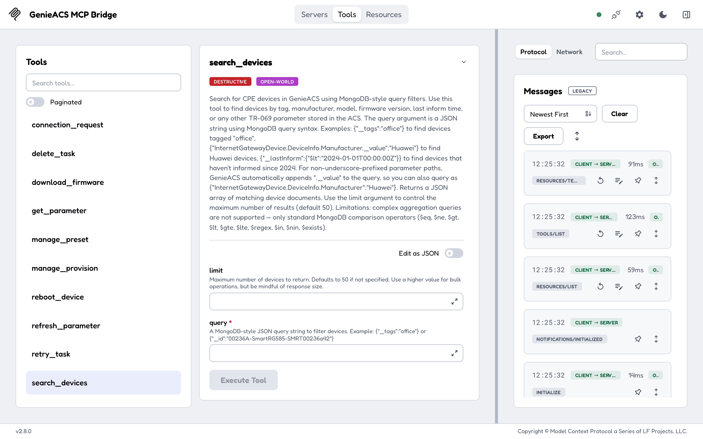
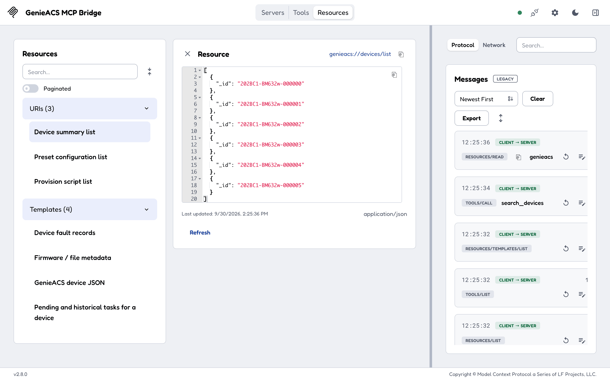
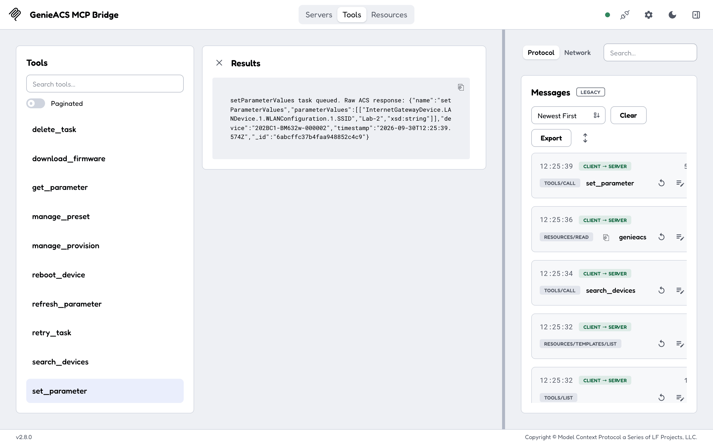

# Usage

Once the server is in your client (see [Configuration](configuration.md#client-configuration)), you talk
to your devices through the client. This page is what the client sees: 7 resources it can read and 12
tools it can call, and which of them change something.

## Example prompts

- "Which devices have not informed in the last 24 hours?" (the client calls `search_devices` with a
  `_lastInform` filter)
- "What firmware do the devices tagged `pilot` run?" (`search_devices` by tag, then `get_parameter` for
  `InternetGatewayDevice.DeviceInfo.SoftwareVersion` on each)
- "Reboot 202BC1-BM632w-000002 and tell me when it is back" (`reboot_device`, then `refresh_parameter` for
  the uptime)



## Resources (read-only)

| URI | Returns |
|---|---|
| `genieacs://devices/list` | The ids of every device the ACS knows, up to `DEVICE_LIMIT` (default 500). Read this first to get valid ids. |
| `genieacs://device/{id}` | One device's full document: every parameter the ACS has collected, tags, last inform time, task history. |
| `genieacs://tasks/{id}` | The tasks still waiting for device `{id}`. GenieACS deletes a task once the device has run it, so a finished task is gone; a faulted one stays, with its fault under `faults/{id}`. |
| `genieacs://faults/{id}` | The faults recorded for device `{id}`. |
| `genieacs://file/{name}` | The metadata of a file stored on the ACS (a firmware image, a config file). |
| `genieacs://presets/list` | Every preset on the ACS. |
| `genieacs://provisions/list` | Every provision script on the ACS. |



## Tools

Two tools only read. The other ten queue a task on a device (the ACS sends a connection request at once,
so a reachable device runs it within seconds), wake a device, or change the ACS. There is no read-only
mode: the tool list is the same for every client, so use your client's approval prompts for the ones
that act.

| Tool | Arguments | What it does | Reads or acts |
|---|---|---|---|
| `search_devices` | `query` (JSON string, MongoDB syntax), `limit` (default 50) | Finds devices by tag, manufacturer, model, firmware, last inform or any parameter. Comparison operators only (`$eq`, `$ne`, `$gt`, `$lt`, `$gte`, `$lte`, `$regex`, `$in`, `$nin`, `$exists`). | reads |
| `get_parameter` | `device_id`, `parameter_path` (one path or a comma-separated list) | Returns the last values the ACS has for those parameters, without contacting the device. Stale if the device has not informed recently. | reads |
| `refresh_parameter` | `device_id`, `parameter` | Asks the device to report one parameter's current value; read it afterwards from `genieacs://device/{id}`. | acts |
| `set_parameter` | `device_id`, `parameter_values` (JSON array of `[path, value]` or `[path, value, xsdType]` tuples; example below the table) | Writes parameter values on the device; the type is inferred when omitted. | acts |
| `reboot_device` | `device_id` | Reboots the device. No confirmation that it came back; check uptime afterwards. | acts |
| `download_firmware` | `device_id`, `file_id`, `filename` (optional) | Tells the device to download and apply a file stored on the ACS. | acts |
| `connection_request` | `device_id` | Wakes the device so it contacts the ACS now. Fails with 504 when the device is unreachable (NAT, offline). | acts |
| `tag_device` | `device_id`, `tag`, `action` (`add` or `remove`) | Adds or removes a tag; presets match on tags. | acts |
| `manage_preset` | `action` (`put` or `delete`), `name`, `body` (JSON, for `put`) | Creates, replaces or deletes a preset on the ACS. | acts |
| `manage_provision` | `action` (`put` or `delete`), `name`, `script` (for `put`) | Creates, replaces or deletes a provision script on the ACS. | acts |
| `delete_task` | `task_id` | Removes a queued task. | acts |
| `retry_task` | `task_id` | Re-queues a failed task. | acts |

A `parameter_values` example for `set_parameter`, renaming the WiFi network:

```json
[
  [
    "InternetGatewayDevice.LANDevice.1.WLANConfiguration.1.SSID",
    "Lab-2",
    "xsd:string"
  ]
]
```



## On the wire

The client speaks MCP JSON-RPC to the server: `initialize`, then `resources/list`, `resources/read`,
`tools/list` and `tools/call`. Over HTTP everything goes to the single `/mcp` endpoint; over stdio,
one JSON-RPC message per line. A worked exchange is on [Getting started](getting-started.md#first-run).
